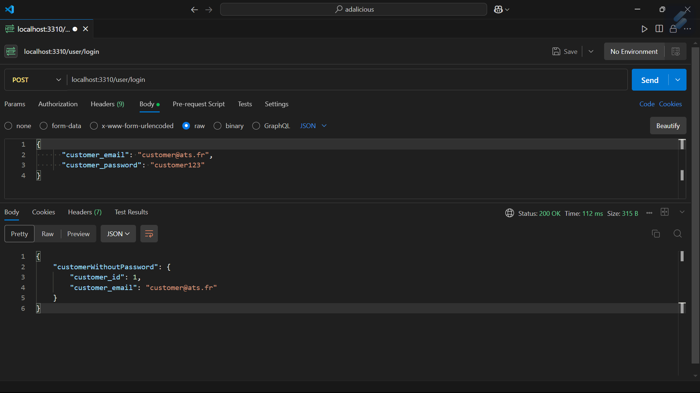
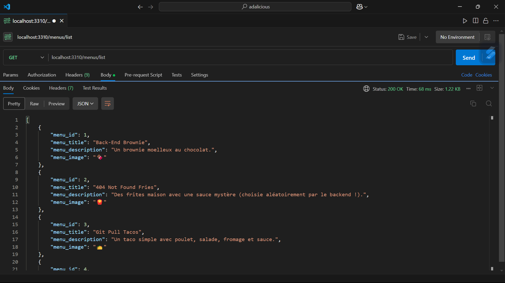
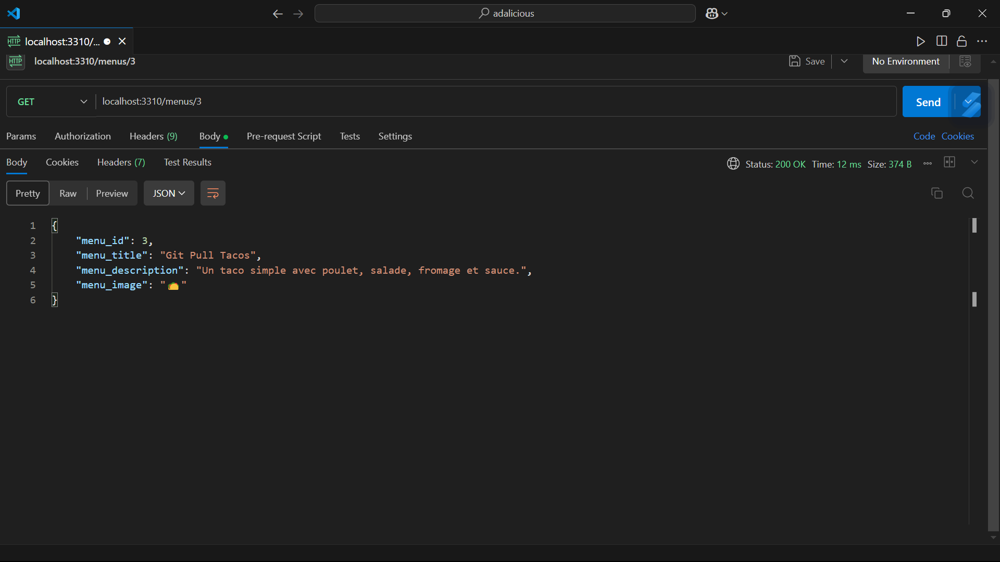
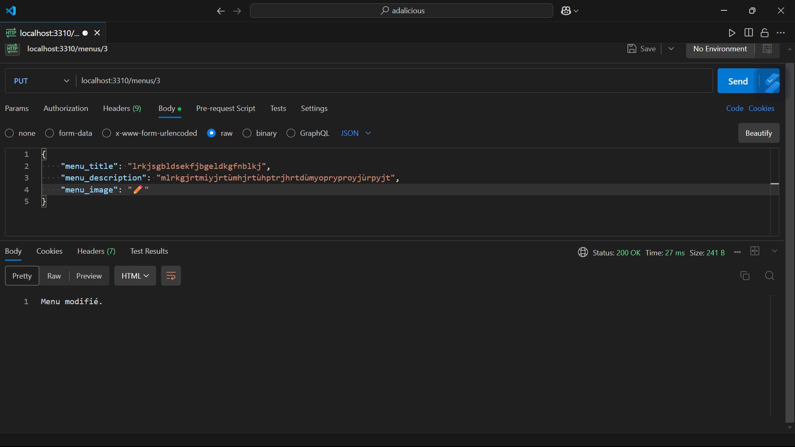
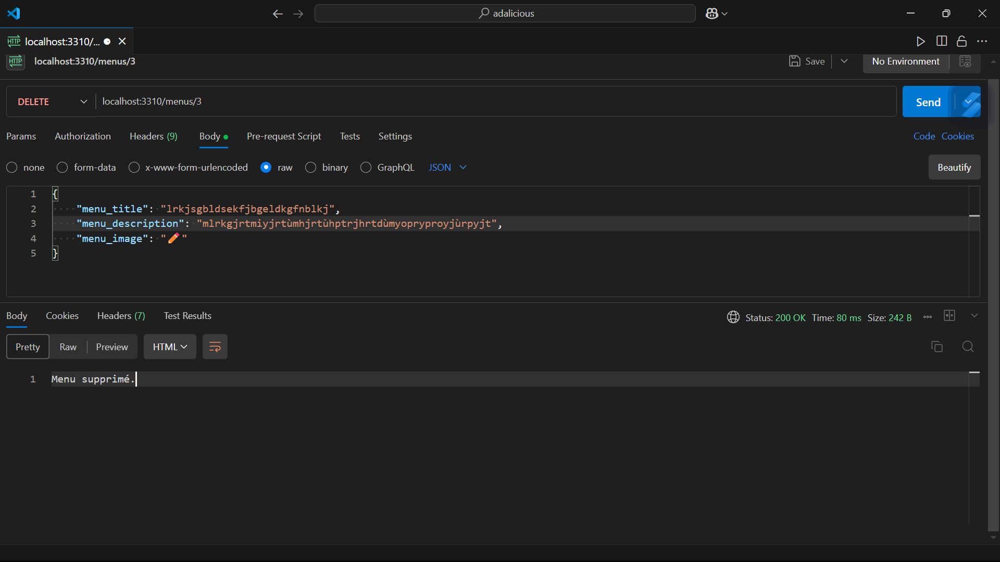

# Adalicious

## POST /user/login : connecte le client

## GET /menus/list : récupère la liste des menus

## GET /menus/{menu_id} : récupère un menu dans la liste

## PUT /menus/{menu_id} : modifie un menu

## DELETE /menus/{menu_id} : supprime un menu

